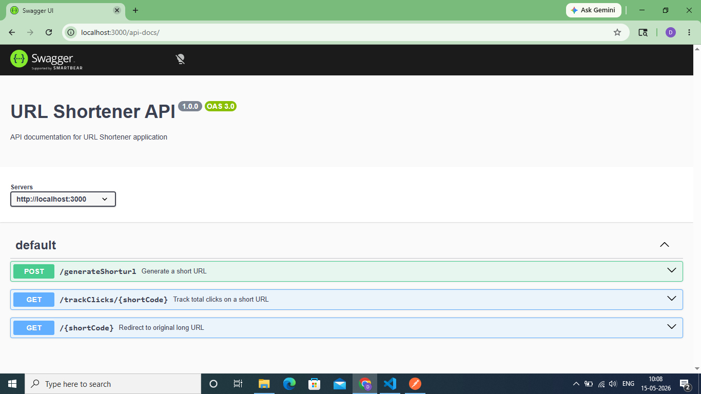

# URL Shortener API

A backend URL Shortener application built with Node.js and Express.js. It converts long URLs into shorter, more manageable links, redirects users to the original long URL when the short URL is accessed, and tracks the number of clicks on each shortened URL.

To make the application production-ready, Redis caching is used for faster URL lookups and rate limiting is implemented to prevent server overload and ensure fair usage.

## 💡 Why I Built This
I built this project to understand how real-world URL shortener services like Bitly and TinyURL work internally. Key learning areas included Redis caching strategies, rate limiting, duplicate URL detection, and production deployment using Render and Redis Cloud.

## 🚀 Live API

**Base URL:**  
`https://url-shortener-api-9gji.onrender.com`

> ⚠️ Note: First request may take 30-60 seconds to respond as the free tier spins down after inactivity.

## ✨ Features

- Generate short URLs from long URLs with unique short codes.
- Support for custom short codes (4-8 alphanumeric characters).
- Redirect short URLs to original long URLs.
- Click count tracking for each short URL.
- Redis caching with TTL (1 hour) for faster URL lookups.
- Rate limiting (7 requests per minute per IP) to prevent server overload.
- Duplicate URL detection — returns the existing short URL if the long URL already exists.

## 🔧 Key Technical Decisions

- **Redis caching with TTL:** Used Redis Cloud to cache frequently accessed URLs with 1 hour expiry to reduce MongoDB load and improve response time.
- **Rate limiting:** Added 7 requests per minute limit per IP to prevent abuse and ensure fair usage across all users.
- **Index on shortCode:** Added MongoDB index on shortCode field for faster lookups during URL redirection, reducing lookup time from O(N) to O(log N).
- **Nanoid for unique codes:** Used nanoid with custom alphabet (62 characters, 8 length) giving 218 trillion possible combinations — very low collision probability.
- **Duplicate URL detection:** Before generating a new short URL, the system checks if the long URL already exists in MongoDB and returns the existing short URL instead of creating a duplicate.

## 🏗️ Architecture

```bash
                        Client (Postman / Browser)
                                    |
               _____________________|_____________________
              |                                           |
    POST /generateShorturl                        GET /:shortCode
              |                             GET /trackClicks/:shortCode
              ↓                                           |
       Rate Limiter                               Rate Limiter
       (7 req/min)                                (7 req/min)
              |                                           |
              ↓                                           ↓
        Express API                               Express API
       (Validate                                (Check shortCode)
        longURL)                                          |
              |                              _____________|_____________
              ↓                             |                           |
       MongoDB                            Redis                        Redis 
    (Save longURL +               (Cache hit → return)      (Cache hit → return)
      shortCode)                         |                           |
              |                     Cache miss                  Cache miss
              ↓                          |                           |
         Response                     MongoDB                     MongoDB 
      (Return shortURL)           (Fetch longURL)          (Fetch click count)
                                         |                           |
                                  Store in Redis              Store in Redis
                                    TTL 1hr                     TTL 1hr
                                         |                           |
                                      Response                  Response
                                  (302 redirect               (Return total
                                   to longURL)                   clicks)
```

## 🗂️ Project Structure

```bash
URL-Shortener-API/
├── index.js               # Entry point
├── controllers/
│   └── urlController.js   # API logic
├── models/
│   └── UrlModel.js        # MongoDB schema
├── router/
│   └── routes.js          # Route definitions
├── middleware/
│   └── rateLimiter.js     # Rate limiting middleware
├── validator/
│   └── validation.js      # Input validation
├── redisConfig.js         # Redis client configuration
└── swaggerConfig.js       # Swagger API documentation configuration
```

## 🗃️ URL Model

urlModel stores information about the URLs, including their long and shortened versions, associated unique identifiers (short codes), and tracking the number of clicks.

* **Fields:**

   `longURL`: `String` (Represents the original long URL provided by the user).

   `shortCode`: `String` (Represents the unique identifier for the shortened URL. This field must be unique).

   `urlClickcount`: `Number` (Represents the total number of clicks on the shortened URL. Default value is 0).

   `createdAt`: `Date` (Auto-generated timestamp when the document is created).

   `updatedAt`: `Date` (Auto-generated timestamp when the document is updated).

## 📬 Endpoints

### URL

- **Generate a Short URL**

  - **Method:** `POST`
  - **Endpoint:** `/generateShorturl`
  - **Live URL:** `https://url-shortener-api-9gji.onrender.com/generateShorturl`
  - **Description:** Generates a short URL from the provided long URL and saves it in the database.

  - **Request Body:**

```json
{
  "longURL": "https://medium.com/@sandeep4.verma/system-design-scalable-url-shortener-service-like-tinyurl-106f30f23a82",
  "customShortcode": "mylink"
}
```

> Note: `customShortcode` is optional. If not provided, a unique 8-character code is automatically generated.

  - **Success Response (201):**

```json
{
  "status": true,
  "message": "ShortUrl generated",
  "data": "https://url-shortener-api-9gji.onrender.com/0956Aq4"
}
```

  - **Long URL Already Exists (200):**

```json
{
    "status": true,
    "message": "longURL already exist",
    "data": "https://url-shortener-api-9gji.onrender.com/0956Aq4"
}
```

---

- **Redirect the Short URL to the Original Long URL**

  - **Method:** `GET`
  - **Endpoint:** `/:shortCode`
  - **Live URL:** `https://url-shortener-api-9gji.onrender.com/:shortCode`
  - **Example:** `https://url-shortener-api-9gji.onrender.com/0956Aq4`

  - **Description:** Redirects the user to the original long URL associated with the provided short URL and increments the click count.

  - **Response:** Redirects to the original long URL with status `302`.

---

- **Track the Total Number of Clicks on the Generated Short URL**

  - **Method:** `GET`
  - **Endpoint:** `/trackClicks/:shortCode`
  - **Live URL:** `https://url-shortener-api-9gji.onrender.com/trackClicks/:shortCode`
  - **Example:** `https://url-shortener-api-9gji.onrender.com/trackClicks/0956Aq4`

  - **Description:** Returns the total number of clicks for the provided short URL.

  - **Success Response (200):**

```json
{
  "status": true,
  "message": "total clicks",
  "totalClicks": 5
}
```

## 🧪 Testing the Live API

You can explore and test all the API endpoints of this URL Shortener application using **Swagger UI**, **Postman**, or the **Live API on Render**.

### 📖 Swagger UI (Recommended)
Open the live Swagger UI directly in your browser:

**Live Swagger URL:**
`https://url-shortener-api-9gji.onrender.com/api-docs`

### Preview:


---

### 🧪 Postman
1. Open Postman.
2. Use the base URL:
   `https://url-shortener-api-9gji.onrender.com`
3. Test the endpoints described above.

---

### 🚀 Live API on Render
The application is deployed and live on Render:

`https://url-shortener-api-9gji.onrender.com`

> ⚠️ First request may take 30-60 seconds because of the free-tier cold start.
```
```
## 💻 Running URL Shortener Application

To run the `URL-Shortener-API` application, follow these steps:

1. **Ensure that you have Node.js and npm installed on your system.**

2. **Clone the repository to your local machine:**

```bash
git clone https://github.com/Dipali127/URL-Shortener-API.git
```

3. **Navigate to the root directory of the project:**

```bash
cd URL-Shortener-API
```

4. **Install dependencies:**

```bash
npm install
```

5. **Create a `.env` file in the root directory and add the following environment variables:**

```env
PORT=3000
MONGO_URI=your_mongodb_connection_string
BASE_URL=http://localhost:3000
REDIS_HOST=your_redis_cloud_host
REDIS_PORT=your_redis_cloud_port
REDIS_PASSWORD=your_redis_cloud_password
```

6. **Start the application:**

```bash
npm start
```

7. **Test APIs using Postman:**

```bash
POST http://localhost:3000/generateShorturl
GET  http://localhost:3000/:shortCode
GET  http://localhost:3000/trackClicks/:shortCode
```

## ⚙️ Tech Stack

- **Runtime Environment:** Node.js
- **Backend Framework:** Express.js
- **Database:** MongoDB Atlas
- **Caching Layer:** Redis Cloud
- **Package for Unique Short Codes:** [nanoid](https://www.npmjs.com/package/nanoid)
- **Rate Limiting Middleware:** express-rate-limit
- **Environment Variables Management:** [dotenv](https://www.npmjs.com/package/dotenv)
- **Development Server Monitor:** [nodemon](https://www.npmjs.com/package/nodemon)
- **API Documentation:** [swagger-ui-express](https://www.npmjs.com/package/swagger-ui-express) and [swagger-jsdoc](https://www.npmjs.com/package/swagger-jsdoc)

## 🔑 Environment Variables

| Variable | Description |
|---|---|
| `PORT` | Server port (default: 3000) |
| `MONGO_URI` | MongoDB Atlas connection string |
| `BASE_URL` | Base URL for generating short URLs |
| `REDIS_HOST` | Redis Cloud hostname |
| `REDIS_PORT` | Redis Cloud port |
| `REDIS_PASSWORD` | Redis Cloud password |

## Helpful Links

[Visit this link to create short unique code using “nanoid” package](https://github.com/ai/nanoid?tab=readme-ov-file#readme)

[Visit this link to know more about long URL](https://medium.com/@hemant.ramphul/the-stucture-of-an-url-c59a6ccf7184)